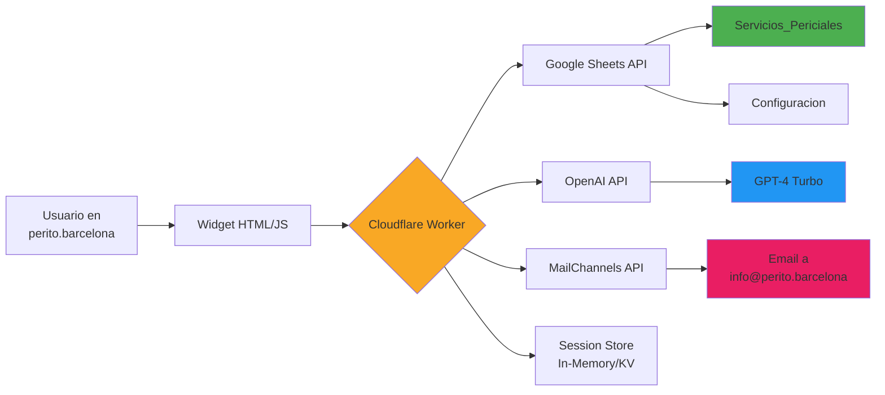
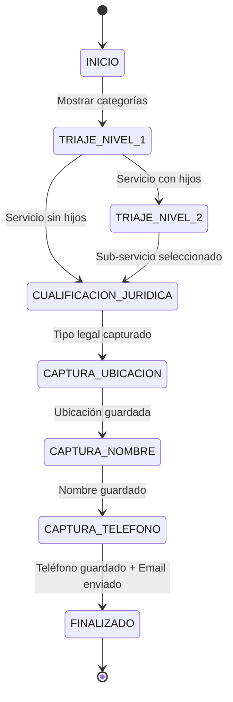
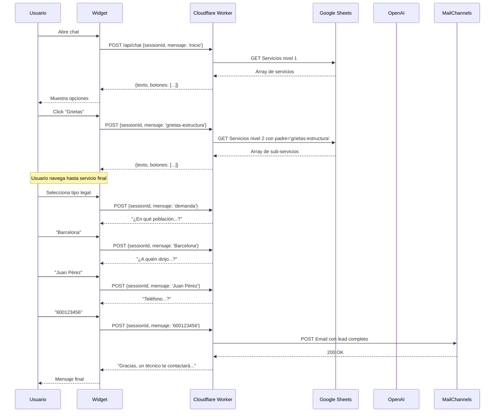
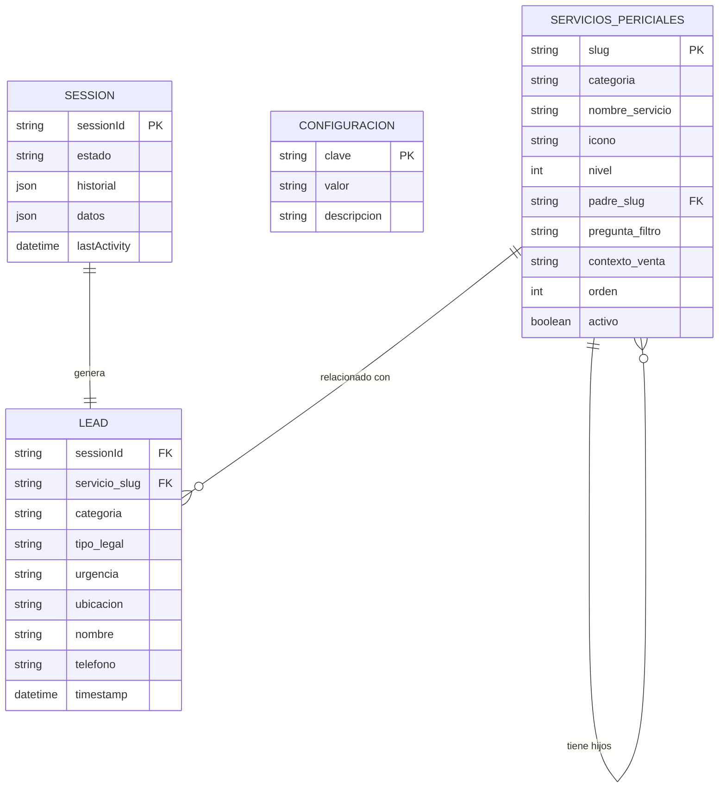

# DIAGRAMA DE FLUJO - CHATBOT PERITO.BARCELONA

## Flujo de Conversación Completo

```mermaid
graph TD
    A[Usuario llega al sitio] --> B[Widget de chat visible]
    B --> C{Usuario abre chat}
    C -->|Sí| D[Estado: INICIO]
    
    D --> E[Bot: 'Bienvenido a Perito.barcelona<br/>¿Cuál es la naturaleza del problema?']
    E --> F[Mostrar botones nivel 1:<br/>🏗️ Grietas<br/>💧 Humedades<br/>⚖️ Disputa<br/>🔍 Vicios]
    
    F --> G{Usuario selecciona}
    G --> H[Estado: TRIAJE_NIVEL_1]
    
    H --> I{¿Tiene sub-niveles?}
    I -->|Sí| J[Bot: Pregunta específica<br/>del servicio]
    I -->|No| N[Estado: CUALIFICACION_JURIDICA]
    
    J --> K[Mostrar botones nivel 2]
    K --> L{Usuario selecciona}
    L --> M[Estado: TRIAJE_NIVEL_2]
    M --> N
    
    N --> O[Bot: '¿Existe ya una demanda judicial<br/>en curso o es reclamación previa?']
    O --> P[Mostrar botones:<br/>📜 Ya hay demanda<br/>🛡️ Reclamación previa]
    
    P --> Q{Usuario selecciona}
    Q -->|Demanda| R[Marcar: URGENCIA ALTA]
    Q -->|Reclamación| S[Marcar: URGENCIA MEDIA]
    
    R --> T[Estado: CAPTURA_UBICACION]
    S --> T
    
    T --> U[Bot: '¿En qué población está<br/>el inmueble?']
    U --> V{Usuario escribe}
    V --> W[Guardar ubicación]
    W --> X[Estado: CAPTURA_NOMBRE]
    
    X --> Y[Bot: '¿A quién dirijo el<br/>informe preliminar?']
    Y --> Z{Usuario escribe}
    Z --> AA[Guardar nombre]
    AA --> AB[Estado: CAPTURA_TELEFONO]
    
    AB --> AC[Bot: 'Teléfono para<br/>comentar el caso:']
    AC --> AD{Usuario escribe}
    AD --> AE[Guardar teléfono]
    
    AE --> AF[Compilar datos del lead]
    AF --> AG[Enviar email vía MailChannels]
    AG --> AH{Email enviado?}
    
    AH -->|Sí| AI[Bot: 'Gracias. Un técnico<br/>te contactará en 24h']
    AH -->|No| AJ[Log error + Retry]
    AJ --> AG
    
    AI --> AK[Estado: FINALIZADO]
    AK --> AL[Limpiar sesión]
    AL --> AM[Fin]
```

## Arquitectura Técnica

## Estados de la Máquina de Estados

## Flujo de Datos (Lead)

## Estructura de Datos (Google Sheets)

---

## Cómo leer estos diagramas

### 1. Flujo de Conversación
- Muestra todos los pasos que el usuario realiza
- Decisiones clave resaltadas en rombos
- Estados del chatbot en rectángulos

### 2. Arquitectura Técnica
- Componentes del sistema y sus conexiones
- APIs externas utilizadas
- Flujo de datos

### 3. Máquina de Estados
- Estados posibles del chatbot
- Transiciones entre estados
- Condiciones de cambio

### 4. Flujo de Datos (Secuencia)
- Interacción temporal entre componentes
- Orden de las llamadas API
- Formato de mensajes

### 5. Estructura de Datos
- Relaciones entre entidades
- Campos clave de cada tabla/entidad
- Claves primarias y foráneas

---

## Visualización Online

Para ver estos diagramas renderizados:

1. Copiar el código Mermaid
2. Pegar en: https://mermaid.live/
3. O usar extensión Mermaid en VS Code

---

**Nota**: GitHub y muchos editores Markdown renderizan automáticamente diagramas Mermaid.
